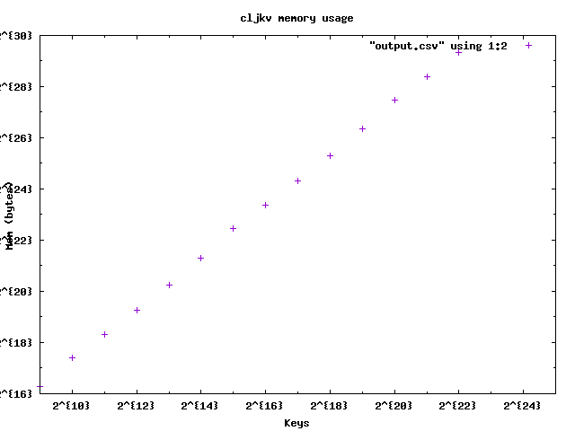

# cljkv

A simple mutable in-memory key value store.

## Usage

`cljkv` is a mutable in memory key value store written in Clojure. The mutable
data structure chosen is an atom and a hash map.

### Constructor

Construct a store using the `create-mutable-store` function:

``` clojure
(def my-store (cljkv.core/create-mutable-store)
```

### Inserting

Insert into the store using the `insert` function

``` clojure
(cljkv.core/insert my-store "key" "value")
```

Keys can have a time to live which means they will not be returned after a
specific number of milliseconds:

``` clojure
(cljkv.core/insert my-store "key" "value" 50)
```

### Deleting

Delete from the store using the `delete` function

``` clojure
(cljkv.core/delete store "key")
```

### Fetching

Fetch a value from the store using the `fetch` function

``` clojure
(def res (cljkv.core/fetch store "key"))
```

### Counting

Get the number of pairs in the store using them `items` function

``` clojure
(cljkv.core/items store)
```

## Design goals

* API
  * Insert;
  * Insert with TTL;
  * Fetch;
  * Delete;
* Ability to store up to 10 million pairs;
* Fetch P95 time of less than 1ms;
* Fetch P99 time of less than 5ms;
* Ability to share the store between multiple threads.

## Reasons for picking Clojure

Clojure was picked because of the authors curiosity about the language and
some of it's concurrency primitives.

Although this version of the library only uses atoms, the author did spend
some time changing the implementation to work with some of Clojure's other
features (like agents). Those versions are not in this library as they are
not needed to meet the design goals and did perform somewhat worse. That is
most probably because the author has as of yet limited experience in working
with those primitives.

Another reason for picking Clojure is the REPL. It allowed for rapid testing
of ideas.

## Implementation

The library exposes a `hash-map` and coordinates updates via an atom. Atoms
are a way to provide synchronous independent state in Clojure which can be
safely shared between multiple threads.

The first implementation was a immutable key value store that exposed the
same operations. This was done to try out the performance of Clojure's hash maps.
The result of that spike showed that unless atoms would slow down the operations
by many orders of magnitude a hash map would be more than enough to meet the
goals of the library.

Other options, such as GNU Trove (High Performance Collection in Java), were
considered. Since the goals could be met without using moving away from the
built-in data types they were not explored in detail.

## Performance

Clojure's hash map are a persistent implementation of Phil Bagwell's Hash Array
Mapped Trie called PersistentHashMap.

The bit-partitioned trie powering the PersistentHashMap has a branching factor
of 32. Only 2^32 hash codes can fit into the trie nodes so our worst case
scenario for `get`, `assoc` and `dissoc` is `O(log32 2^32)` or about `O(7)`.

## Memory usage

Estimating memory usage in Java as objects grow is notoriously hard since no
primitives like `sizeof` exist.

To estimate the memory usage of this library I use
[`java-sizeof`](https://github.com/dweiss/java-sizeof).



You can run the memory usage test by like so:

``` bash
$ cat measure_mem.clj|lein repl
```

And plot the results:

``` bash
$ gnuplot -c plot.gp
```